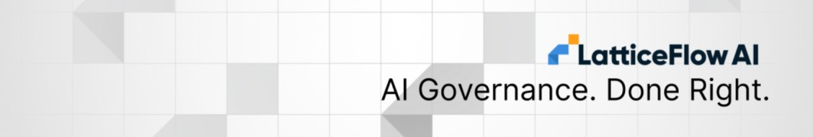

<p align="center">
  <a href="https://latticeflow.ai">
</a>
</p>

<div align="center">
    AI GO! is a platform for AI governance operationalization developed by

[LatticeFlow AI](https://latticeflow.ai/).
</div>

<div align="center">

[](https://latticeflow.ai)
[](https://aigo.latticeflow.io/docs)

</div>

# AI GO! Integrations

Welcome to the **LatticeFlow AI GO! Integrations** repository.

This repository serves as the central hub for learning how to connect your AI ecosystem
with the LatticeFlow AI GO! platform. Whether you are benchmarking your AI system,
connecting a custom RAG agent, or evaluating safety guardrails, this repository contains
integration examples to seamlessly make your AI assets native to the AI GO!.

## Quickstart

To get started, choose any guide in [`guides`](./guides) and read the `README.md`.

For example, to run an evaluation on the knowledge of a model on a specific topic, see
[`README.md`](./guides/evaluation-qa-llm-scorer/README.md).

1. Export OpenAI API key in the terminal.

    ```bash
    export OPENAI_API_KEY=<$OPENAI_API_KEY>
    ```

2. Run the commands.

    ```bash
    lf add app -f app.yaml
    lf switch playground-app
    lf integration add --provider openai --api-key $OPENAI_API_KEY
    lf run -f run.yaml
    ```

3. Explore results.

## Developer Guide

Create a virtual environment and install dependencies:

```bash
uv venv --python 3.12
source .venv/bin/activate
uv pip install latticeflow-go-sdk
```

Install pre-commit hooks before contributing:

```bash
uv pip install pre-commit
pre-commit install && pre-commit install -t pre-push
```
